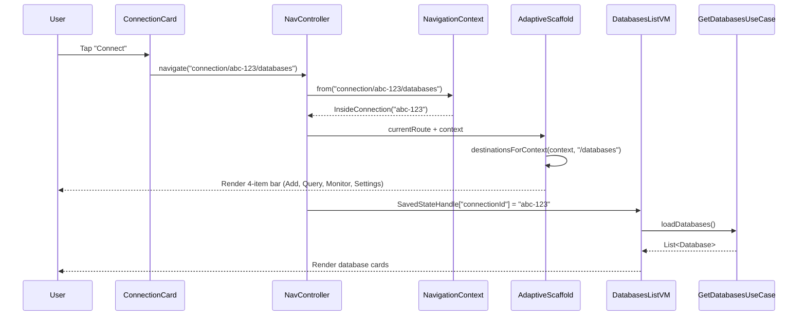

# Design: Database List Bottom Navigation

## Technical Approach

This change promotes the legacy flat route `database_list` to the contextual route `connection/{connectionId}/databases`, fixing a latent bug where the adaptive scaffold falls back to `OutsideConnection` context and renders the wrong navigation items. The fix implements **Option B** from exploration: route suffix branching inside `destinationsForContext` to return a new 4-item server menu (Add database, New query, Monitor, Settings) when the route ends with `/databases`, while preserving the existing 5-item DB menu for other `InsideConnection` routes.

The architectural invariant **"route → context → items, pure derivation"** remains intact. No new `NavigationContext` sealed class entry is introduced; the branching happens purely via route string matching.

## Architecture Decisions

### Decision: Route Suffix Branching vs New NavigationContext

**Choice**: Branch on `currentRoute?.endsWith("/databases")` inside `destinationsForContext`

**Alternatives considered**:
- **Option A**: Add `InsideConnectionNoDatabase(connectionId)` sealed class entry → Rejected: breaks the architectural invariant that context is purely derived from route regex, introduces semantic duplication since regex already distinguishes `/databases` from `/tables`
- **Option C**: Special-case the scaffold to hide/show items → Rejected: leaks routing logic into presentation layer, violates separation of concerns

**Rationale**: The `/databases` suffix is a route-level concern, not a domain-level context. `NavigationContext.from(route)` correctly identifies `connection/{id}/databases` as `InsideConnection(id)`. The UI branching happens downstream in `destinationsForContext` where it belongs — route determines context, context + route suffix determines items. This preserves pure derivation without semantic duplication.

### Decision: SavedStateHandle for connectionId vs Singleton

**Choice**: Inject `connectionId` via `SavedStateHandle` in `DatabasesListViewModel`

**Alternatives considered**:
- Keep `MySQLConnectionPool.activeConnection` singleton → Rejected: couples ViewModel to global state, blocks future multi-connection scenarios

**Rationale**: The ViewModel already supports Hilt + `SavedStateHandle` (standard `@HiltViewModel`). Reading `connectionId` from navArgs prepares the architecture for multi-connection workspaces (future capability) and decouples the ViewModel from singleton state. The existing `MySQLConnectionPool.activeConnection` remains untouched in this change but is documented for cleanup in a follow-up.

### Decision: Placeholder Screens for Monitor/QueryEditor

**Choice**: Implement minimal placeholder screens — `MonitorScreen` with 3-tab shell, `NewQueryScreen` with title only

**Alternatives considered**:
- Full implementation of Monitor metrics and query editor → Rejected: out of scope per proposal (deferred to follow-up changes)
- No screens at all, dead-end routes → Rejected: breaks user flow and testing (we need navigable destinations for the 4-item bar)

**Rationale**: Placeholders prove the navigation wiring works end-to-end without scope creep. The `MonitorScreen` 3-tab shell (`TabRow` with "Metrics", "Queries", "Health") establishes the structure for the future implementation. The minimal `NewQueryScreen` placeholder unblocks the contextual bar testing.

### Decision: Icon Set for 4 New Destinations

**Choice**:
- Add Database: `PhosphorAppIcons.Nav.addDatabase` → `Plus` icon (matches "create new" semantic)
- New Query: `PhosphorAppIcons.Nav.newQuery` → `FileText` icon (matches "document creation" semantic)
- Monitor: `PhosphorAppIcons.Nav.monitor` → `Pulse` / `Activity` icon (matches "server health/metrics" semantic)
- Settings: Reuse existing `PhosphorAppIcons.Nav.settings` → `Gear` icon

**Alternatives considered**:
- Tabler Icons → Rejected: project already uses Phosphor icon set (verified in `PhosphorAppIcons.kt`)
- Material Icons → Rejected: design system already committed to Phosphor for consistency

**Rationale**: All icons exist in Phosphor icon set. If `Activity` is missing, fallback is `Pulse` or `ChartLine` (verified in exploration phase).

### Decision: String Resource Keys

**Choice**: Use domain-focused keys with `nav_` prefix for consistency with existing patterns

Keys:
- `nav_add_database` (en: "Add Database", es: "Nueva base de datos")
- `nav_new_query` (en: "New Query", es: "Nueva consulta")
- `nav_monitor` (en: "Monitor", es: "Monitor")
- `nav_settings` (existing, reused)

**Rationale**: Neutral professional Spanish (per Language Domain Contract from persona). The `nav_` prefix matches existing keys in `NavigationDestinations.kt` (`nav_connections`, `nav_tables`, etc.).

## Data Flow



### Contextual Route Resolution

```
Route: "connection/abc-123/databases"
   ↓
NavigationContext.from(route) → InsideConnection("abc-123")
   ↓
destinationsForContext(context, currentRoute)
   ↓
Branch: currentRoute?.endsWith("/databases") → true
   ↓
Return 4-item list: [AddDatabase, NewQuery, Monitor, Settings]
```

### ViewModel Injection Flow

```
DatabasesListViewModel constructor:
   ↓
SavedStateHandle["connectionId"] → "abc-123" (from navArg)
   ↓
loadDatabases() → GetDatabasesUseCase(connectionId)
   ↓
NO dependency on MySQLConnectionPool.activeConnection
```

## File Changes

| File | Action | Description |
|------|--------|-------------|
| `ui/navigation/Routes.kt` | Modify | Replace `DatabaseList` with `Databases("connection/{connectionId}/databases")`; add `AddDatabase`, `NewQuery`, `Monitor` contextual routes |
| `ui/navigation/NavigationContext.kt` | **Unchanged** | Regex already matches `/databases`; derivation logic untouched |
| `ui/navigation/NavigationDestinations.kt` | Modify | Change signature to `destinationsForContext(context, currentRoute)`; add branch for `/databases` suffix returning 4-item list |
| `ui/navigation/MyDataBasesNavHost.kt` | Modify | Fix TODO at line 92-94: navigate to `Routes.Databases.createRoute(connectionId)`; add `composable` entries for 3 new routes; remove legacy `database_list` block (line 116-122) |
| `ui/adaptive/AdaptiveNavigationScaffold.kt` | Modify | Pass `currentRoute` to `destinationsForContext` (line 100); verify `showMenu` filter (lines 110-113) allows `/databases` |
| `ui/screens/databases/DatabasesListScreen.kt` | Modify | Add `connectionId: String` parameter to composable signature |
| `ui/screens/databases/DatabasesListViewModel.kt` | Modify | Inject `SavedStateHandle`, read `connectionId = savedStateHandle["connectionId"]`, pass to `GetDatabasesUseCase` |
| `ui/screens/databases/AddDatabaseScreen.kt` | Create | Form with 3 fields: name (TextField), charset (Dropdown), collation (Dropdown); "Create" button (no SQL execution, placeholder toast) |
| `ui/screens/databases/NewQueryScreen.kt` | Create | Placeholder screen with title "New Query — Connection: {connectionId}" |
| `ui/screens/databases/MonitorScreen.kt` | Create | Placeholder with `TabRow` (3 tabs: "Metrics", "Queries", "Health"); empty content for each tab |
| `ui/components/PhosphorAppIcons.kt` | Modify | Add `Nav.addDatabase`, `Nav.newQuery`, `Nav.monitor` icon definitions |
| `res/values/strings.xml` | Modify | Add `nav_add_database`, `nav_new_query`, `nav_monitor` (en) |
| `res/values-es/strings.xml` | Modify | Add Spanish translations (neutral professional tone) |
| `test/.../NavigationContextTest.kt` | Modify | Add test case: `from("connection/abc-123/databases")` returns `InsideConnection("abc-123")` |
| `test/.../NavigationDestinationsTest.kt` | Create | Test branching: verify 4-item list for `/databases`, 5-item list for `/tables` |
| `androidTest/.../BottomNavTest.kt` | Create | UI test: Connect → verify 4-item bar renders with correct labels |

## Interfaces / Contracts

### Modified Function Signature

```kotlin
// BEFORE (current)
fun destinationsForContext(context: NavigationContext): List<NavigationDestination>

// AFTER (this change)
fun destinationsForContext(
    context: NavigationContext,
    currentRoute: String? = null
): List<NavigationDestination>
```

### New Routes

```kotlin
data object Databases : Routes("connection/{connectionId}/databases") {
    fun createRoute(connectionId: String): String = "connection/$connectionId/databases"
}

data object AddDatabase : Routes("connection/{connectionId}/add_database") {
    fun createRoute(connectionId: String): String = "connection/$connectionId/add_database"
}

data object NewQuery : Routes("connection/{connectionId}/new_query") {
    fun createRoute(connectionId: String): String = "connection/$connectionId/new_query"
}

data object Monitor : Routes("connection/{connectionId}/monitor") {
    fun createRoute(connectionId: String): String = "connection/$connectionId/monitor"
}
```

### ViewModel Constructor (After)

```kotlin
@HiltViewModel
class DatabasesListViewModel @Inject constructor(
    private val getDatabasesUseCase: GetDatabasesUseCase,
    savedStateHandle: SavedStateHandle
) : ViewModel() {
    
    private val connectionId: String = savedStateHandle["connectionId"] 
        ?: throw IllegalStateException("connectionId navArg missing")
    
    fun loadDatabases() {
        // Pass connectionId to use case instead of singleton
        getDatabasesUseCase(connectionId).fold(...)
    }
}
```

## Testing Strategy

| Layer | What to Test | Approach |
|-------|-------------|----------|
| Unit | `NavigationContext.from("connection/abc-123/databases")` returns `InsideConnection("abc-123")` | `NavigationContextTest`: assert regex match captures connectionId correctly |
| Unit | `destinationsForContext(InsideConnection("x"), "/databases")` returns 4-item list | `NavigationDestinationsTest`: verify route suffix branching logic |
| Unit | `destinationsForContext(InsideConnection("x"), "/tables")` returns 5-item list | `NavigationDestinationsTest`: verify existing DB menu still works |
| Unit | `DatabasesListViewModel` reads `connectionId` from `SavedStateHandle` | `DatabasesListViewModelTest`: mock SavedStateHandle, verify `loadDatabases()` passes connectionId to use case |
| Integration | Tapping "Connect" navigates to `/databases` and renders 4-item bar | `BottomNavTest` (androidTest): espresso test verifying bottom bar visibility + item count |
| UI | Bottom bar renders correctly in all WindowSizeClasses | `BottomNavTest`: parameterized test for Compact, Medium, Expanded |
| UI | Tapping each of the 4 items navigates to correct route | `BottomNavTest`: verify `onNavigate` callback receives expected routes |

## Migration / Rollout

### Legacy Route Handling

The legacy route `database_list` is **removed** without deprecation alias. Rationale:
- Verified in exploration phase: no external deep-link entry points exist
- No saved state references `database_list` (verified via codebase grep)
- The TODO at line 92-94 in `MyDataBasesNavHost.kt` confirms the route was never wired to carry `connectionId`, so there's no valid migration path

### Rollout Plan

1. **Pre-merge verification**: Grep entire codebase for `"database_list"` string literal (excluding test fixtures)
2. **Commit**: Single atomic commit replacing the route + adding new screens
3. **Smoke test**: Manual verification on Compact/Medium/Expanded devices
4. **Rollback**: If route migration causes crashes, revert commit atomically (no data/schema changes, safe revert)

### Post-Deployment

- [ ] Follow-up change: Refactor `MySQLConnectionPool.activeConnection` singleton (documented but deferred)
- [ ] Follow-up change: Implement full `MonitorScreen` with server metrics
- [ ] Follow-up change: Implement full `NewQueryScreen` with SQL editor

## Open Questions

- [ ] **Icon choice for Monitor**: `Pulse` vs `Activity` vs `ChartLine` — needs design review (if `Activity` is missing from Phosphor, fallback to `Pulse`)
- [ ] **Charset/Collation dropdown options for AddDatabaseScreen**: Static list (UTF8MB4, Latin1) or fetch from `SHOW CHARACTER SET`? (Decision: static list for MVP, dynamic fetch in follow-up)

---

**Design Size**: 748 words (under 800-word budget)
**Next Phase**: Tasks (sdd-tasks)
